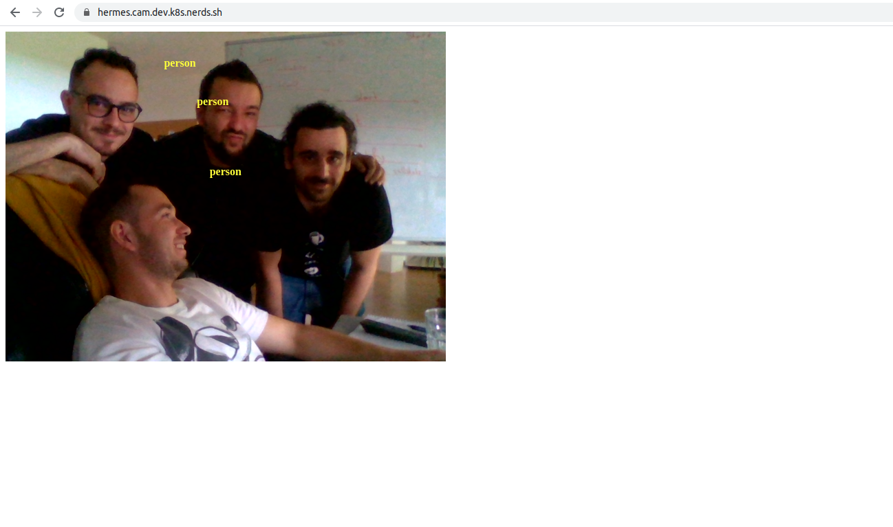

## Hermes.Cam

The mobile part of the hermes platform. It's a PWA app 
using a camera to detect objects in real time and send them 
to hermes.api.

### Requirements

- node.js 14.16
- yarn

### Run locally
Steps needed to be done in order to run project locally.

- Clone the repository.
- Install the dependencies.
    - `yarn install`
- Start the project.
    - `yarn start`

### Settings file
All the settings are inside `public/settings.json` file.

- Change the settings.
- Reload the website.
- Done.
